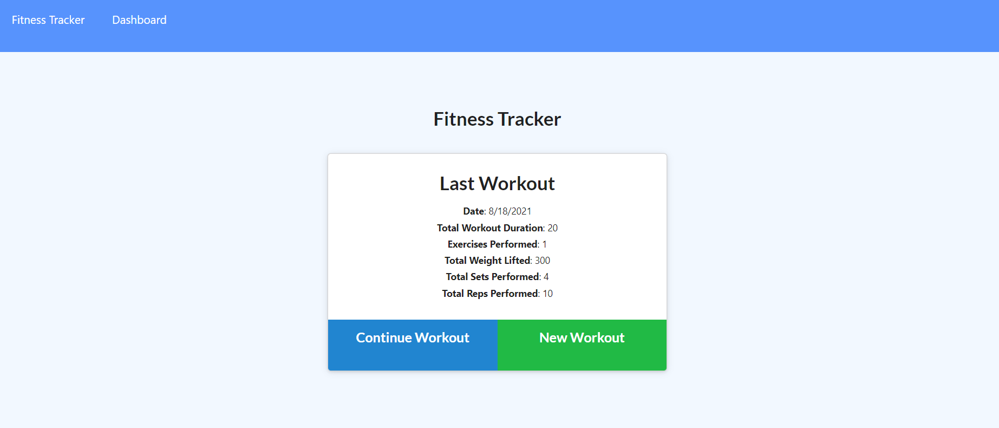
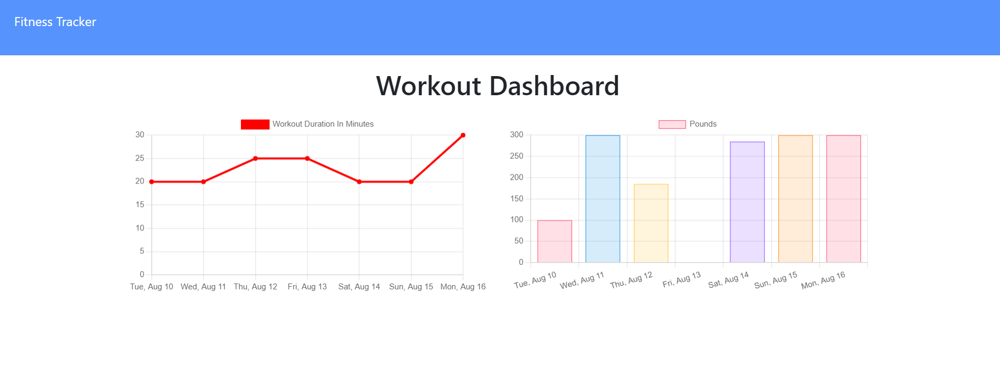

# Fitness Tracker

Live Deployed Link: https://agile-bayou-56340.herokuapp.com/?id=611eb3e1592a900016e9eecf

## Description

This application provides the user a place to track their workouts. It will track and display the last 7 days that they input their workout. 

## Table of Contents

- [Installation](#installation)
- [Usage](#usage)
- [Credits](#credits)
- [License](#license)
- [Features](#features)
- [Contributing](#contributing)

## Installation

Make sure you have a code editor, terminal of your choosing installed on your local computer.

Install npm and Node.js on your local computer.

Install Git and Github on your local computer and register to get an account.

Install MongoDB and create an account.

Clone or Fork this repository: (https://github.com/cbeard22/fitnessTracker)

After cloning the repository to your local computer:
- Initialize npm 

You can then deploy this to Heroku or you can run it on your local computer.

## Usage

  - First follow the live link to the deployed site at the top of this README.md.

  - You will then be brought to the website where you can enter a resistance or cardio exercise. You can then add more exercises or you can view the last 7 days exercise on the dashboard page. 

  - Now that you are at the homepage you can add one exercise or multiple exercises from that day. To view the weeks exercises click on the dashboard test in the upper left corner. 

  - This is where the 7 day list of activity will be displayed. 

## Credits
  - [Chris Beard:](https://github.com/cbeard22)
  
- For this project I utilized:
    - Mongoose
    - Mongo DB
    - Heroku
    - Node
    - NPM
    - Express
    - Javascript
    - API
 

## License

MIT License

Copyright (c) [2021] [Chris Beard]

Permission is hereby granted, free of charge, to any person obtaining a copy of this software and associated documentation files (the "Software"), to deal in the Software without restriction, including without limitation the rights to use, copy, modify, merge, publish, distribute, sublicense, and/or sell copies of the Software, and to permit persons to whom the Software is furnished to do so, subject to the following conditions:

The above copyright notice and this permission notice shall be included in all copies or substantial portions of the Software.

THE SOFTWARE IS PROVIDED "AS IS", WITHOUT WARRANTY OF ANY KIND, EXPRESS OR IMPLIED, INCLUDING BUT NOT LIMITED TO THE WARRANTIES OF MERCHANTABILITY, FITNESS FOR A PARTICULAR PURPOSE AND NONINFRINGEMENT. IN NO EVENT SHALL THE AUTHORS OR COPYRIGHT HOLDERS BE LIABLE FOR ANY CLAIM, DAMAGES OR OTHER LIABILITY, WHETHER IN AN ACTION OF CONTRACT, TORT OR OTHERWISE, ARISING FROM, OUT OF OR IN CONNECTION WITH THE SOFTWARE OR THE USE OR OTHER DEALINGS IN THE SOFTWARE.

## Contributing

If you have any suggestions about how I could improve this application, please contact me on my github page.
  - 
